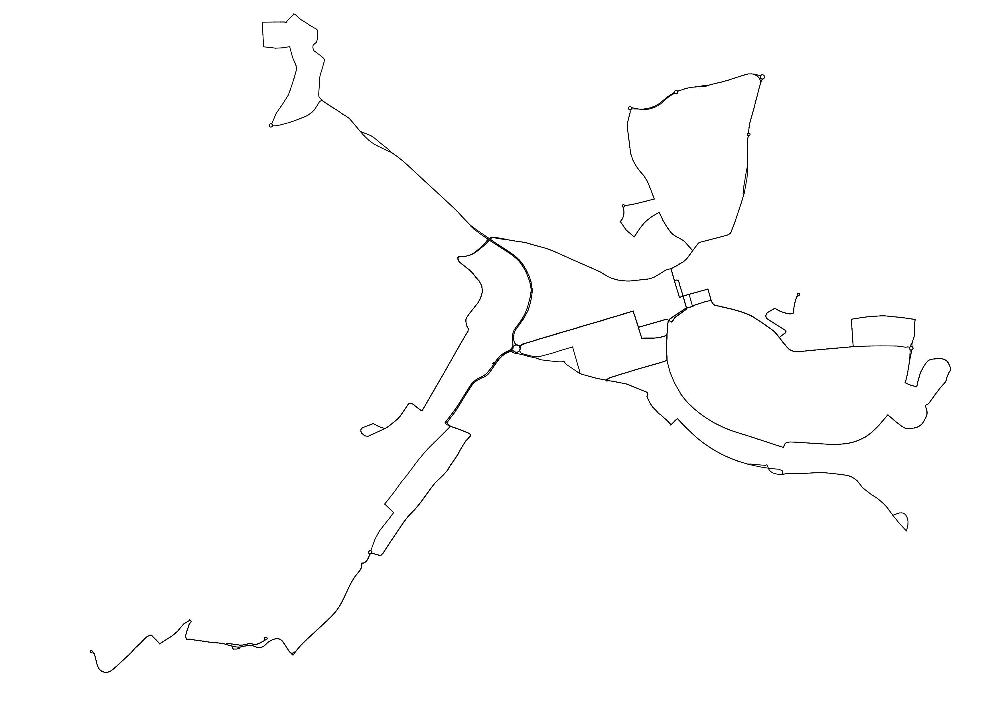
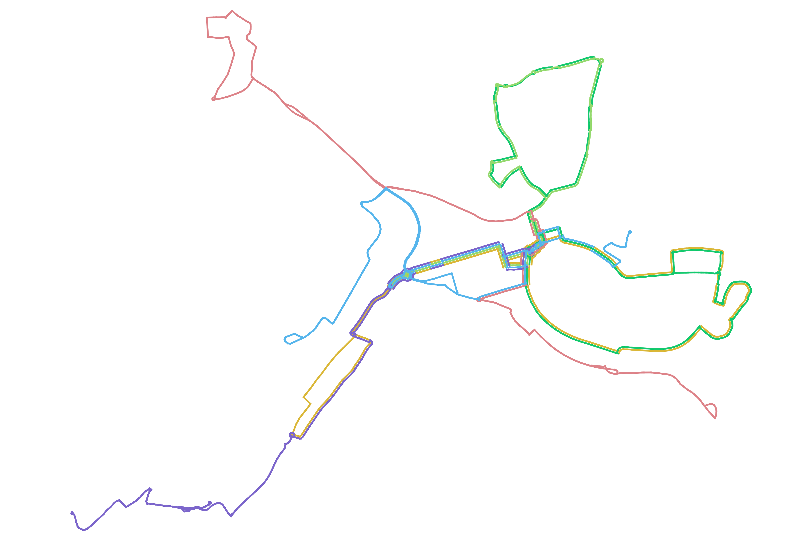

# Offsetter QGIS Plugin

This plugin solves the problem of displaying overlapping lines independently. It calculates an offest value for each line feature in such a way that all line features of the same geometry have different offset values. After using this offset value for QGIS symbology, the lines are displayed next to each other. This can be useful for displaying public transport lines for example.

Four things to be aware of:
1. It just identifies completely overlapping lines. If you have a layer with partly overlapping lines, you have to split the lines at intersections or all vertices first, e.&nbsp;g. with [v.clean](https://grass.osgeo.org/grass-stable/manuals/v.clean.html) from [GRASS GIS](https://docs.qgis.org/latest/en/docs/user_manual/grass_integration/grass_integration.html) or [Explode lines](https://docs.qgis.org/latest/en/docs/user_manual/processing_algs/qgis/vectorgeometry.html#explode-lines). The latter produces better results because of the simplified algorithm (see below) but the layer size will be much bigger.
2. In this moment the comparing algorithm is quite simplified: It just compares first and last vertex of each line, ignoring the vertices in between. Lines with identical start and end points but different routes will be incorrectly identified as the same. 
3. It does take into account, if lines overlap completely but have different directions. The offset values are assigned accordingly to display the lines next to each other. 
4. The order of the lines is assigned randomly. It may take some postprocessing to get a pretty result, where lines are not changing their order randomly at some points.

The next two pictures show the plugin functionality for the bus network of the city of Tuttlingen (map data from [OpenStreetMap](https://www.openstreetmap.org/copyright)) .

## Functionality

The plugin adds several fields to the original layer. The most important is the "offset" field. Values in the "offest" field are computed in such a way that the difference between two lines, displayed next to each other, is always 2. So if there is on line in section, the assigned value will be 0. Two lines in one section are assigned values of -1 and 1. Three lines are assigned values of 2-, 0 and 2 and so forth. This applies, if lines are of the same direction. If a line is in the opposite direction, its value is multiplied by -1. Thus, two lines with opposite directions displayed next to each other are both assigned a value of 1.

The other added fields are:

|Field|Explanation|
|--|--|
|section_id|Randomly assigned integer id for each section of lines with identical start and end points.|
|direction|For each section ramdomly assigned direction 1 or 2 to mark which line feature in one section is of which direction.|
|position|Position value, starting at 0, to mark the order of display in each section.|
|same_count|Number of line features in the section.|
|offset|See above.|

## Usage

1. Download this repository and [zip](https://en.wikipedia.org/wiki/ZIP_(file_format)) it.
2. Use the [Install from ZIP](https://docs.qgis.org/3.40/en/docs/user_manual/plugins/plugins.html#the-install-from-zip-tab) function to install the plugin. Afterwards you will find it in the [Processing Toolbox](https://docs.qgis.org/3.40/en/docs/user_manual/processing/toolbox.html).
3. Open the window and select your input line layer.
4. Choose the field where the category is stored you want to see displayed next to each other. In public transport networks for example it may be the line number. 
5. Choose the output location and rund the algorithm.
6. The algorithm added some fields, among others one named "offset". Open the symbology section and got to the "Offest" Option. On the right side you open a drop-down menu and select "Edit..." to write a formula for the Offset using the Expression Builder.
7. Here you are able to adjust the Offset depending on the "offset" field of your processed layer and the width of your line. E.&nbsp;g. if your lines are 0.66 mm thick and you write `0.33 * offset`, your lines are displayed directly anlongside each other. `0.4 * offset` would give them a little bit of space. 
8. After that you could categorize them according to your category field, chosen in step 4.

## Acknowledgements

This plugin was originally generated by [Plugin Builder](http://g-sherman.github.io/Qgis-Plugin-Builder/).